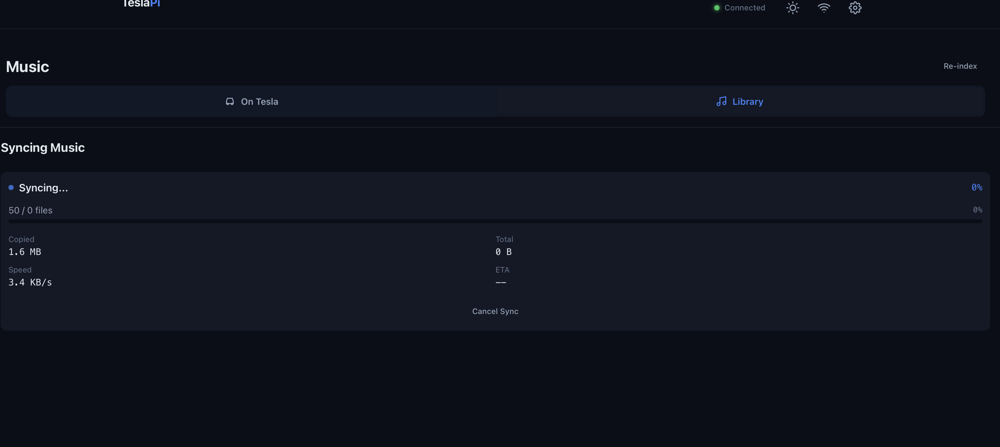
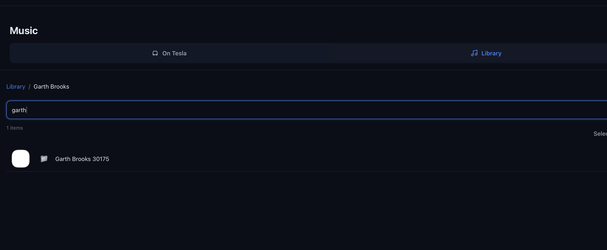

# TeslaPi

A complete, modern replacement for [teslausb](https://github.com/marcone/teslausb) that turns a Raspberry Pi into a smart USB drive for your Tesla.

TeslaPi handles everything: USB drive provisioning, dashcam recording, automatic archiving to your NAS, music syncing from network shares, Home Assistant integration, and remote access via WireGuard. It installs on a standard Raspberry Pi OS image with no custom flashing required, and all configuration is done through a modern web UI that works on your phone, laptop, or the Tesla's built-in browser.

Inspired by marcone/teslausb's proven USB gadget approach, TeslaPi is built from the ground up with a Preact frontend and Python FastAPI backend. The entire UI ships under 65KB gzipped.

## Screenshots

| Music Sync | Settings |
|-----------|----------|
|  |  |

## Features

### Dashboard
- Real-time status display with animated status ring (idle, archiving, syncing)
- Storage capacity bars for dashcam, music, and external drives with color-coded thresholds
- System health monitoring: CPU temperature, RAM usage, uptime, WiFi signal strength
- Latest dashcam events at a glance
- Archive and music sync status summaries

### Dashcam Viewer
- Multi-angle synchronized playback across all 6 Tesla cameras
- Six layout modes: 2x3 grid, 3x2 grid, front-focus, single camera, side-by-side, picture-in-picture
- Timeline with clip boundaries and sentry event markers
- Transport controls with variable speed (0.5x--2x) and fullscreen support
- Event browser with date grouping and type filters (Sentry, Saved, Recent)

### Music Sync
- Browse CIFS and NFS network shares directly from the web UI
- SQLite FTS5-powered search across 50,000+ tracks with sub-200ms response
- Virtual-scrolled artist/album tree with checkbox selection for selective sync
- Real-time sync progress with rsync, automatic USB gadget lifecycle management
- Sync queue with size estimates and cancellation support

### File Manager
- Split-pane browser with tabs for Music, Light Show, and Boombox drives
- Lazy-loading directory tree with sortable file list and multi-select
- Drag-and-drop upload with progress tracking
- Inline audio playback and context menus
- Keyboard navigation support

### Home Assistant Integration

**Recommended:** Install the [TeslaPi HACS Component](https://github.com/nickpdawson/TeslaPi_HACS) for full Home Assistant integration. It provides:
- 10 sensors (status, CPU temp, storage, WiFi signal, archive/sync timestamps, artist count)
- 6 binary sensors (online, gadget active, archive running, music syncing, server reachable, auto-sync)
- 3 buttons (Archive Now, Sync Music, Reboot)
- 2 switches (USB Gadget, Auto-Sync)
- Media browser for dashcam clips (browse and play from HA Media panel)
- Custom services with full parameter control
- Config flow with auto-discovery

Install via HACS or manually. See the [TeslaPi_HACS repository](https://github.com/nickpdawson/TeslaPi_HACS) for setup instructions.

The TeslaPi backend also supports direct REST API integration:
- Push 8 sensor entities to Home Assistant via REST API (status, storage, temperature, timestamps)
- Optional MQTT with auto-discovery
- Background state push every 30 seconds
- Event push on archive completion, sync completion, errors, and storage warnings

### Network and Connectivity
- Multi-WiFi management with priority ordering
- Hotspot failover for initial setup and mobile access
- WireGuard tunnel configuration for remote access to home network shares
- Network diagnostics and signal monitoring

### Notifications
- Unified dispatcher supporting Telegram, Discord, Slack, Matrix, email (SMTP), SNS, and Home Assistant
- Configurable event-to-channel routing matrix (8 event types)
- Per-channel test buttons and notification history

### Settings
- All configuration manageable through the web UI -- no manual `.conf` editing required
- General settings (hostname, timezone, WiFi), network shares, drive configuration, notification channels, Home Assistant setup, and system administration
- First-run wizard that detects existing `teslausb_setup_variables.conf` and pre-fills settings

### Design
- Dark mode by default with light mode toggle
- Responsive layout: single column on mobile, multi-column on desktop
- Tesla browser compatible (1200x600 viewport, no backdrop-filter, touch targets at least 44px)
- Skeleton loading states, toast notifications, smooth CSS transitions
- Progressive Web App support for mobile "Add to Home Screen"

## Screenshots

Screenshots coming soon -- the project is preparing for its first deployment on hardware.

## Architecture

```
                    +----------------------------------+
                    |         Nginx (port 80)          |
                    |  /  -> Preact SPA (static)       |
                    |  /api/* -> FastAPI (:8080)       |
                    |  /TeslaCam/* -> fancyindex        |
                    +--------------+-------------------+
                                   |
                    +--------------v-------------------+
                    |      FastAPI (uvicorn :8080)      |
                    |                                   |
                    |  Routers:                         |
                    |   /api/status    /api/files       |
                    |   /api/config    /api/music       |
                    |   /api/shares    /api/ha          |
                    |   /api/dashcam   /api/notify      |
                    |   /api/gadget    /api/system      |
                    |   /api/ws/logs   /api/ws/status   |
                    |                                   |
                    |  Services:                        |
                    |   ScriptRunner -> bash scripts    |
                    |   ConfigManager -> .conf files    |
                    |   ShareBrowser -> mount/browse    |
                    |   MusicSync -> rsync selective    |
                    |   MusicIndex -> SQLite FTS5       |
                    |   HAClient -> REST/MQTT           |
                    |   NotifyService -> unified        |
                    |   GadgetManager -> USB state      |
                    +-----------------------------------+
```

The frontend is a Preact SPA (TypeScript, Vite, Signals) that communicates with a Python FastAPI backend over REST and WebSocket. The backend wraps teslausb's existing bash scripts via async subprocess calls, preserving all proven infrastructure. State is stored in SQLite with WAL mode on the Pi's writable `/mutable` partition.

On the Pi itself:
- The root filesystem is read-only (standard teslausb behavior)
- Frontend static files live at `/var/www/teslapi/`
- Backend and Python venv live at `/opt/teslapi/`
- Database and mutable state live at `/mutable/teslapi/`
- USB disk images live on the external drive at `/backingfiles/`

## Quick Start

### Prerequisites

- Raspberry Pi 4 Model B (2GB+ RAM recommended)
- MicroSD card (32GB+ recommended) with Raspberry Pi OS Lite (Bookworm, 64-bit)
- External USB drive (recommended for backing files, especially for large music libraries)
- Tesla vehicle with USB port
- On your dev machine: Node.js 18+, Python 3.11+

### Installation

#### Option 1: Deploy to an existing teslausb Pi

If you already have a working teslausb setup on a Pi connected to your network:

```bash
git clone https://github.com/nickpdawson/TeslaPi.git
cd TeslaPi
./deploy/deploy-to-pi.sh <pi-ip-or-hostname>
```

This builds the frontend, packages everything into a tarball, uploads it to the Pi, and runs the installer. The Pi's root filesystem is temporarily remounted read-write during installation, then returned to read-only. No data is lost.

#### Option 2: Fresh install on a new SD card

1. Flash Raspberry Pi OS Lite (64-bit, Bookworm) to an SD card using [Raspberry Pi Imager](https://www.raspberrypi.com/software/)

2. Follow the standard [teslausb setup](https://github.com/marcone/teslausb) instructions

3. Before running teslausb setup, replace the web UI script:
   ```bash
   # On the Pi, after cloning teslausb but before running setup:
   cp /path/to/TeslaPi/deploy/configure-web.sh /root/bin/configure-web.sh
   ```

4. Complete the teslausb setup, then deploy TeslaPi on top:
   ```bash
   ./deploy/deploy-to-pi.sh <pi-ip>
   ```

#### Option 3: Development setup

See the [Development](#development) section below.

### Updating

The installer is idempotent. To update an existing installation:

```bash
./deploy/deploy-to-pi.sh <pi-ip>
```

The database and state on `/mutable/teslapi/` persist across updates.

## Configuration

All settings are manageable through the web UI at `http://<pi-ip>/settings`. Configuration sections include:

- **General** -- Hostname, timezone, WiFi networks
- **Network Shares** -- CIFS/NFS share configuration for archive and music sources, with connection testing
- **Drives** -- Backing file sizes, filesystem type, external drive (`DATA_DRIVE`) settings
- **Notifications** -- Channel setup (Telegram, Discord, email, etc.) with per-event routing
- **Home Assistant** -- URL, long-lived access token, MQTT settings, entity selection
- **System** -- Reboot, log viewer, diagnostics

The underlying `teslausb_setup_variables.conf` file is read and written by the backend, preserving its format for compatibility with the upstream teslausb scripts.

## Development

### Frontend

```bash
cd frontend
npm install
npm run dev        # Start Vite dev server with hot reload
npm run build      # Production build to dist/
npm run preview    # Preview production build locally
```

The frontend is built with:
- **Preact** (10.x) -- React-compatible, 3KB gzipped
- **TypeScript** (6.x) with strict mode
- **Vite** (8.x) for bundling
- **Preact Signals** for reactive state management
- **preact-router** for client-side routing
- CSS custom properties for theming (no CSS-in-JS runtime)

### Backend

```bash
cd backend
python -m venv venv
source venv/bin/activate
pip install -e ".[dev]"
uvicorn backend.main:app --reload --host 0.0.0.0 --port 8080
```

The backend is built with:
- **FastAPI** with async endpoints
- **SQLite** with aiosqlite (WAL mode, FTS5 for music search)
- **Pydantic** v2 for validation and settings
- **httpx** for async HTTP (Home Assistant API)
- **websockets** for live log streaming

In development mode, the backend returns mock data so you can work on the UI without a Pi.

### Building for deployment

```bash
bash deploy/build.sh
```

This builds the frontend, packages the backend and frontend together into `dist/teslapi.tar.gz`, ready to deploy to a Pi.

## How It Works

TeslaPi builds on teslausb's USB gadget mode, which presents the Raspberry Pi as a USB mass storage device to the Tesla vehicle.

**The cycle:**

1. **Driving** -- The Pi is in USB gadget mode. The Tesla sees it as a USB drive and writes dashcam footage (TeslaCam) to the cam disk image. Music is available for playback from the music disk image.

2. **Parked at home** -- The Pi detects a known WiFi network and transitions out of gadget mode. It mounts the disk images locally and begins the archive loop:
   - Dashcam clips are archived to the configured network share (CIFS or NFS)
   - If music sync is configured, new tracks are rsynced from the music source share
   - Home Assistant sensors are updated, notifications are sent on completion

3. **Back to driving** -- When WiFi is lost (or on a schedule), the Pi unmounts, returns to gadget mode, and the Tesla can record and play music again.

TeslaPi adds a web dashboard accessible over WiFi during step 2, giving you visibility into the entire process and control over music sync, archive settings, and system configuration.

## Network Architecture

TeslaPi supports flexible network connectivity:

- **Home WiFi** -- Primary connection. When parked at home, the Pi connects to your WiFi network for archiving, music sync, and dashboard access.

- **Hotspot failover** -- Configure your phone as a fallback WiFi network. Useful for initial setup or accessing the dashboard away from home.

- **WireGuard tunnel** -- Optional VPN tunnel back to your home network. Enables remote access to the dashboard and network shares (e.g., music library on a NAS) even when connected via a mobile hotspot or a different WiFi network.

WiFi networks are prioritized in the configuration. The Pi attempts connections in order and falls back through the list. The WireGuard tunnel activates automatically when the Pi has network connectivity, providing a persistent path to home network resources.

## Contributing

Contributions are welcome. To get started:

1. Fork the repository
2. Create a feature branch (`git checkout -b feature/my-feature`)
3. Make your changes and verify the build passes (`npm run build` in `frontend/`)
4. Test on a Pi if possible, or verify with mock data in dev mode
5. Submit a pull request

Please keep the following in mind:
- The frontend must remain Tesla browser compatible (Chromium-based, no backdrop-filter, no CSS gap, touch targets at least 44px)
- Total frontend bundle size should stay under 200KB gzipped
- All existing teslausb bash scripts and configuration format must be preserved
- Backend changes should include mock data fallbacks for development without a Pi

## License

MIT -- forked from [marcone/teslausb](https://github.com/marcone/teslausb)

## Acknowledgments

- [marcone/teslausb](https://github.com/marcone/teslausb) for the proven USB gadget infrastructure, archive loop, and years of community development
